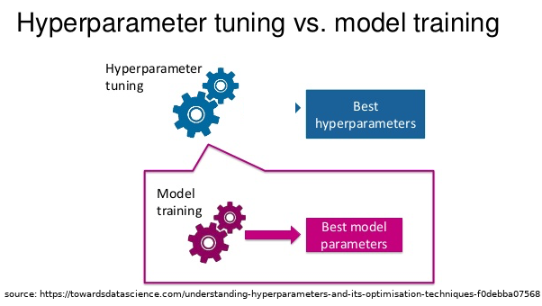
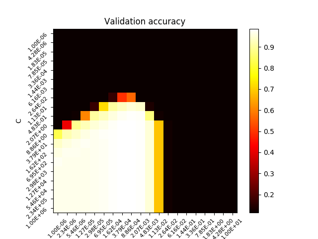

[](https://hpc.uni.lu) [](http://www.gnu.org/licenses/gpl-3.0.html) [](https://github.com/ULHPC/tutorials/issues/) [](https://github.com/ULHPC/tutorials/raw/devel/python/advanced/scikit-learn/slides.pdf) [](https://github.com/ULHPC/tutorials/tree/devel/python/advanced/scikit-learn/) [](http://ulhpc-tutorials.readthedocs.io/en/latest/python/advanced/scikit-learn/) [](https://github.com/ULHPC/tutorials)


# Parallel machine learning with scikit-learn


[](slides.pdf)

[**scikit-learn**](https://scikit-learn.org/stable/) is a python library dedicated to machine learning.
This library allows you to tackle:

* Preprocessing
* Dimensionality reduction
* Clustering
* Classification
* Regression
* etc ...

In this tutorial, we are going to show how to perform parrallel machine learning computations on a High Performance Computing platform such as the **Iris cluster**.

## Dependencies

In this tutorial, we are going to code in python 3 and use the following libraries:

* [numpy](https://www.numpy.org/)
* [scikit-learn](https://scikit-learn.org/stable/)
* [ipyparallel](http://ipython.org/ipython-doc/stable/parallel/parallel_intro.html)
* [joblib](https://joblib.readthedocs.io/en/latest/)

## Creating the virtual environment

Be sure to start with a bare environment:

* No interactive job running and thus no loaded modules
* No python virtualenv already loaded

```bash
# cd into scratch and clone tutorial repository
git clone https://github.com/ULHPC/tutorials.git
# cd into the scripts folder
cd tutorials/python/advanced/scikit-learn/scripts
# First ask for an interactive SLURM job
si
# Load python 3.6 module
module load lang/Python 
# Create your virtual environment
python3 -m venv scikit
# Activate your env
source ./scikit/bin/activate
# Now install required packages
# jupyter himself
pip install ipython
# matplotlib to plot the graph inside your notebook
pip install matplotlib
# ipyparallel for parallel execution of your code on several thread and/or nodes
pip install ipyparallel
# joblib is used to start parrallel scikit-learn jobs
pip install joblib
# scikit-learn 
pip install scikit-learn
# pandas
pip install pandas
# Exit interactive job (setup completed)
exit
```

## Using ipyparrallel with SLURM (generic slurm script)

Hereafter, a general script for using ipyparrallel with the SLURM scheduler is provided. We are going to use it in the remaining part of this tutorial. This is the file ```launcher.sh``` that you can find in the scripts directory. 


```bash

#!/bin/bash -l

#BATCH -p batch           #batch partition 
#SBATCH -J ipy_engines      #job name
#SBATCH -n 10                # 10 cores, you can increase it
#SBATCH -N 2                # 2 node, you can increase it
#SBATCH -t 1:00:00         # Job is killed after 1h

module load lang/Python 

source scikit/bin/activate

#create a new ipython profile appended with the job id number
profile=job_${SLURM_JOB_ID}

echo "Creating profile_${profile}"
ipython profile create ${profile}

ipcontroller --ip="*" --profile=${profile} &
sleep 10

#srun: runs ipengine on each available core
srun ipengine --profile=${profile} --location=$(hostname) &
sleep 25

echo "Launching job for script $1"
python $1 -p ${profile}

```
__________
--ip=* instructs ZeroMQ to listen on all interfaces, but it does not contain the IP needed for engines / clients to know where the controller is. This can be specified with the --location argument, such as --location=10.0.0.1, or --location=server.local, the specific IP address or hostname of the controller, as seen from engines and/or clients. IPython uses socket.gethostname() for this value by default, but it may not always be the right value. Check the location field in your connection files if you are having connection trouble.
__________

Now, we are going to show how to apply **ipyparallel** with machine learning algorithms implemented in **scikit-learn**. First, we will cluster some random generated data in parrallel and then we use parallel hyperparameter optimisation to find the best parameters for a SVM classification model.

## Unsupervised learning: clustering a dataset

Given a dataset in which we do not known apriori how many clusters exist, we are going to perform multiple and parallel clustering in order to find the right number of clusters. 

Some existing approaches (DBSCAN, OPTICS) are now able to detect this number automatically but it is required to have some prior knowlege on the density of the clusters.

Hereafter, we are going to use the very simple K-means clustering algorithm. We will start multiple K-means instances in parrallel with different number of clusters to be detected. 

In the ```unsupervized``` folder, you can find two scripts:

* ```some_funcs.py``` wrapping the Kmeans procedure of the scikit-learn library 

* ```main.py``` which is the main script calling our wrapper


### ```some_funcs.py```: add some logs to kmeans procedure


```python
import os
import datetime
# Library to generate plots
import matplotlib as mpl
# Define Agg as Backend for matplotlib when no X server is running
mpl.use('Agg')
import matplotlib.pyplot as plt
# Importing scikit-learn functions
from sklearn.cluster import  KMeans
from sklearn.metrics.pairwise import pairwise_distances_argmin
from matplotlib.cm import rainbow
# Import the famous numpy library
import numpy as np
# We import socket to have access to the function gethostname()
import socket
import time

# alias to the now function
now = datetime.datetime.now

# To know the location of the python script
FILE_DIR = os.path.dirname(os.path.abspath(__file__))

# We decorate (wrap) the kmeans function
# in order to add some pre and post-processing
def kmeans(nbClusters,X,profile):
    # We create a log for the clustering task
    file_path = os.path.join(os.getcwd(),
                             '{0}_C{1:06}'.format(profile,nbClusters))
    #logging will not work from the HPC engines
    #need to write into a file manualy.
    with open(file_path+".log", 'a+') as f:
        f.write('job started on {0}\n'.format(socket.gethostname()))
        f.write('new task for nbClusters='+str(nbClusters)+'\n')

    t0 = now()
    with open(file_path+".log", 'a+') as f:
        f.write('Start clustering at {0}\n'.format(t0.isoformat()))

    # Original scikit-learn kmeans 
    k_means = KMeans(init='k-means++', n_clusters=nbClusters, n_init=100)
    k_means.fit(X)

    # After clustering has been performed, we record information to 
    # the log file

    t1 = now()
    h = (t1-t0).total_seconds()//3600
    m = (t1-t0).total_seconds()//60 - h*60
    s = (t1-t0).total_seconds() -m*60 - h*60
    with open(file_path+".log", 'a+') as f:
        f.write('Finished at {0} after '
                '{1}h {2}min {3:0.2f}s\n'.format(t1.isoformat(),h,m,s))
        f.write('kmeans\n')
        f.write('nbClusters: {0}\n'.format(str(nbClusters)))

    # We sort the centers
    k_means_cluster_centers = np.sort(k_means.cluster_centers_, axis=0)
    # We assign the labels
    k_means_labels = pairwise_distances_argmin(X, k_means_cluster_centers)

    # The previous part is useful in order to keep the same color for
    # the different clustering

    t_batch = (t1 - t0).total_seconds()

    # We generate a plot in 2D
    colors = rainbow(np.linspace(0, 1, nbClusters))
    fig=plt.figure()
    ax = fig.add_subplot(1, 1, 1)
    for k, col in zip(range(nbClusters), colors):
        my_members = k_means_labels == k
        cluster_center = k_means_cluster_centers[k]
        ax.plot(X[my_members, 0], X[my_members, 1], 'w',
            markerfacecolor=col, marker='.')
        ax.plot(cluster_center[0], cluster_center[1], 'o', markerfacecolor=col,
            markeredgecolor='k', markersize=6)
        ax.set_title('KMeans')
        ax.set_xticks(())
        ax.set_yticks(())
    plt.text(-3.5, 1.8,  'clustering time: %.2fs\ninertia: %f' % (t_batch, k_means.inertia_))
    # We save the figure in png
    plt.savefig(file_path+".png")
    return (nbClusters,k_means.inertia_)


```

### ```main.py```: our main python script to parallelize clustering

```python

import argparse
import logging
import os
import sys
from sklearn.datasets import make_blobs
from joblib import Parallel, parallel_backend
from joblib import register_parallel_backend
from joblib import delayed
from joblib import cpu_count
from ipyparallel import Client
from ipyparallel.joblib import IPythonParallelBackend
import numpy as np
import datetime
#module in the same directory
from some_funcs import kmeans

FILE_DIR = os.path.dirname(os.path.abspath(__file__))
sys.path.append(FILE_DIR)

#prepare the logger
parser = argparse.ArgumentParser()
parser.add_argument("-p", "--profile", default="ipy_profile",
                 help="Name of IPython profile to use")
args = parser.parse_args()
profile = args.profile
logging.basicConfig(filename=os.path.join(FILE_DIR,profile+'.log'),
                    filemode='w',
                    level=logging.DEBUG)
logging.info("number of CPUs found: {0}".format(cpu_count()))
logging.info("args.profile: {0}".format(profile))

#prepare the engines
c = Client(profile=profile)
#The following command will make sure that each engine is running in
# the right working directory to access the custom function(s).
c[:].map(os.chdir, [FILE_DIR]*len(c))
logging.info("c.ids :{0}".format(str(c.ids)))
bview = c.load_balanced_view()
register_parallel_backend('ipyparallel',
                          lambda : IPythonParallelBackend(view=bview))

#Create data
#prepare it for the custom function
X,_ = make_blobs(n_samples=5000,centers=np.random.randint(20))
#some parameters to test in parallel
param_space = {
    'NCLUSTERS': np.arange(2,20)
}


with parallel_backend('ipyparallel'):
    inertia = Parallel(n_jobs=len(c))(delayed(kmeans)(nbClusters,X,profile)
                               for nbClusters in param_space['NCLUSTERS'])


#write down the number of clusters and the total inertia in a file.
with open(os.path.join(FILE_DIR,'scores_kmeans.csv'), 'w') as f:
    f.write('nbClusters,inertia,\n')
    f.write("\n".join(','.join(str(c) for c in l) for l in inertia))
    f.write('\n')
```

### Start parallel clustering

You only need to start the following command from the ```scripts``` directory:
```sbatch launcher.sh unsupervized/main.py```


After job completion, use [scp or rsync](https://hpc.uni.lu/users/docs/filetransfer.html) to retrieve your results on your laptop.


## Supervised learning: SVM classification

This part is strongly based on the following [tutorial](http://www.hyamani.eu/2018/05/20/parallel-super-computing-with-scikit-learn/). The mainstream is to apply parallel hyperoptimisation in order to find the optimal parameters of a SVC model. This part can be applied on many Machine Learning model and Metaheuristics algorithms that require generally many parameters.


### Model parameters vs Hyperparameters

Model **parameters** are the intrinsic properties of the training data. 
Weights, biases are typically model parameters

**Hyperparameters** can be considered as meta-variables. They are respnsible for the training process and are condigured before training.

 


Hyperparameters tuning can be perfomed in scikit-learn using 4 differents approaches:

1. By defining a pre-defined set of hyperparameters to evaluate
2. By applying Grid-search
3. By applying Random search

### Recognize hand-written digits

For this supervised learning example, we will train a SVM classification model to recognize images of hand-written digits. The SVM classifcation model will be C-Support Vector Classification based on the libsvm library. In order to discover the penalty hyperparameter C of the error term, we will rely on the [Grid search approach](https://scikit-learn.org/stable/modules/generated/sklearn.model_selection.GridSearchCV.html#examples-using-sklearn-model-selection-gridsearchcv) implemented in scikit-learn.

The training data will be loaded from scikit-learn [digits library](https://scikit-learn.org/stable/modules/generated/sklearn.datasets.load_digits.html#sklearn.datasets.load_digits). 


The SLURM launcher script remains the same than before. It has been especially designed to be as general as possible. We only need to write a script calling the Grid search procedure with the SVC model. Here we will not wrap the existing SVC algorithm. The script is located in the ```supervized``` folder.

### ```main.py```: using Grid search in parallel

```python
import argparse
import logging
import os
import sys
import matplotlib as mpl
mpl.use('Agg')
import matplotlib.pyplot as plt
from matplotlib.colors import Normalize
from joblib import Parallel, parallel_backend
from joblib import register_parallel_backend
from joblib import delayed
from joblib import cpu_count
from sklearn.datasets import load_digits
from sklearn.model_selection import train_test_split
from sklearn.svm import SVC
from ipyparallel import Client
from ipyparallel.joblib import IPythonParallelBackend
import numpy as np
import pandas as pd
import datetime
from sklearn.model_selection import GridSearchCV

FILE_DIR = os.path.dirname(os.path.abspath(__file__))
sys.path.append(FILE_DIR)

#prepare the logger
parser = argparse.ArgumentParser()
parser.add_argument("-p", "--profile", default="ipy_profile",
                 help="Name of IPython profile to use")
args = parser.parse_args()
profile = args.profile
logging.basicConfig(filename=os.path.join(FILE_DIR,profile+'.log'),
                    filemode='w',
                    level=logging.DEBUG)
logging.info("number of CPUs found: {0}".format(cpu_count()))
logging.info("args.profile: {0}".format(profile))

#prepare the engines
c = Client(profile=profile)
#The following command will make sure that each engine is running in
# the right working directory to access the custom function(s).
c[:].map(os.chdir, [FILE_DIR]*len(c))
logging.info("c.ids :{0}".format(str(c.ids)))
bview = c.load_balanced_view()
register_parallel_backend('ipyparallel',
                          lambda : IPythonParallelBackend(view=bview))

#Get data
digits = load_digits()
#prepare it for the custom function
#it would be better to use cross-validation
#outside the scope of this tutorial
X_train, X_test, y_train, y_test = train_test_split(digits.data,
                                                    digits.target,
                                                    test_size=0.3)
#some parameters to test in parallel
param_space = {
    'C': np.logspace(-6, 6, 20),
    'gamma': np.logspace(-6,1,20)
}


svc_rbf = SVC(kernel='rbf',
              shrinking=False)

search = GridSearchCV(svc_rbf,
                      param_space,
                      return_train_score=True,
                      n_jobs=len(c))

with parallel_backend('ipyparallel'):
    search.fit(X_train, y_train)
results = search.cv_results_
results = pd.DataFrame(results)
results.to_csv(os.path.join(FILE_DIR,'scores_rbf_digits.csv'))


scores = search.cv_results_['mean_test_score'].reshape(len(param_space['C']),len(param_space['gamma']))

plt.figure()
#plt.subplots_adjust(left=.2, right=0.95, bottom=0.15, top=0.95)
plt.imshow(scores, interpolation='nearest', cmap=plt.cm.hot)
plt.xlabel('gamma')
plt.ylabel('C')
plt.colorbar()
plt.xticks(np.arange(len(param_space['gamma'])), map(lambda x : "%.2E"%(x),param_space['gamma']), fontsize=8, rotation=45)
plt.yticks(np.arange(len(param_space['C'])), map(lambda x : "%.2E"%(x),param_space['C']), fontsize=8, rotation=45)
plt.title('Validation accuracy')
plt.savefig(os.path.join(FILE_DIR,"validation.png"))
```
### Start parallel supervized learning

In the ```scripts``` folder, enter the following command ```sbatch launcher.sh supervized/main.py```.

After job completion, use [scp or rsync](https://hpc.uni.lu/users/docs/filetransfer.html) to retrieve your results on your laptop.



## Next 

1. (Part 1.) Adapt the script for another clustering algorithm  
2. (Part 2.) Increase the number of parameters to be searched by the GridSearchCV approach


## References

See the following books to know all about python parallel programming.


<center>
[](https://books.google.fr/books/about/Python_Parallel_Programming_Cookbook.html?id=Aht1CgAAQBAJ&source=kp_book_description&redir_esc=y)
[](https://books.google.fr/books?id=VQDgDAAAQBAJ&printsec=frontcover&dq=Mastering+python&hl=en&sa=X&ved=0ahUKEwiG6dG13fjiAhWkxoUKHcu-DZoQ6AEIKDAA#v=onepage&q=Mastering%20python&f=false)
[](https://books.google.fr/books/about/High_Performance_Python.html?id=bIZaBAAAQBAJ&redir_esc=y)
</center> 
